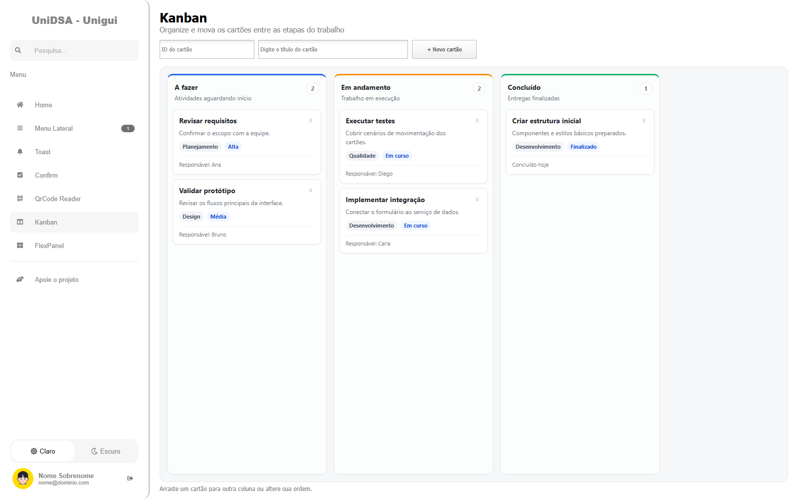
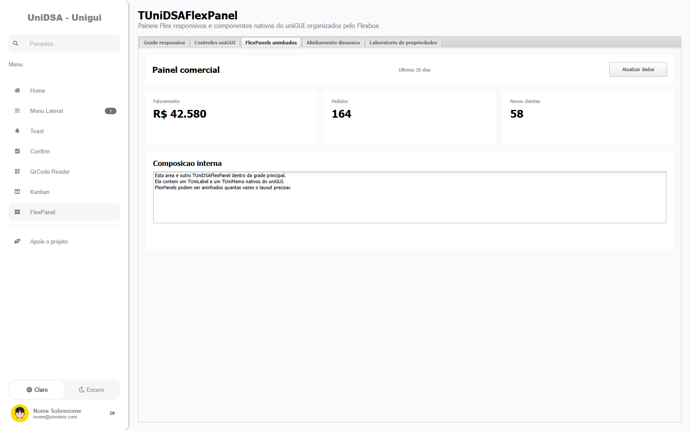

# UniDSA para Delphi e uniGUI


O UniDSA é uma biblioteca de componentes para aplicações web desenvolvidas com Delphi e uniGUI. O projeto reúne diálogos de confirmação, notificações, leitura de códigos, menu lateral, tela de login, quadro Kanban, formulários em etapas e tours guiados, com propriedades configuráveis tanto no Object Inspector quanto em tempo de execução.

## Conteúdo

- [Componentes](#componentes)
- [Estrutura do repositório](#estrutura-do-repositório)
- [Requisitos e compatibilidade](#requisitos-e-compatibilidade)
- [Instalação no Delphi](#instalação-no-delphi)
- [Publicação dos arquivos web](#publicação-dos-arquivos-web)
- [Execução do projeto de demonstração](#execução-do-projeto-de-demonstração)
- [Uso dos componentes](#uso-dos-componentes)
- [Atualização da biblioteca](#atualização-da-biblioteca)
- [Solução de problemas](#solução-de-problemas)
- [Checklist de publicação](#checklist-de-publicação)

## Componentes

| Componente | Finalidade |
| --- | --- |
| `TUniDSAConfirm` | Confirmações, alertas, diálogos e prompts com retorno por AJAX. |
| `TUniDSAToast` | Notificações temporárias com posição, cores, ícones e eventos configuráveis. |
| `TUniDSAQrCodeReader` | Leitura de QR Code e códigos de barras pela câmera do dispositivo. |
| `TUniDSAMenuLateral` | Menu lateral responsivo com temas, pesquisa, perfil e notificações. |
| `TUniDSALogin` | Interface responsiva para autenticação, recuperação de senha e criação de conta. |
| `TUniDSAFlexPanel` | Contêiner visual com Flexbox, breakpoints e composição por filhos diretamente no Delphi. |
| `TUniDSAResponsivePageControl` | PageControl com overflow responsivo das abas em menu ou rolagem. |
| `TUniDSAKanban` | Quadro Kanban responsivo com colunas, cartões, limite WIP e drag-and-drop. |
| `TUniDSATour` | Apresentação guiada da interface com spotlight, posicionamento automático e navegação acessível. |

## Estrutura do repositório

```text
unidsa-unigui-delphi/
├── sources/                  Código-fonte dos componentes
├── dsa/                      JavaScript, CSS e demais assets web
│   ├── css/
│   ├── dist/
│   ├── flex/
│   ├── js/
│   ├── kanban/
│   ├── login/
│   ├── menu_lateral/
│   ├── qrcode_reader/
│   └── tour/
├── demo/                     Aplicação de demonstração
├── images/                   Ícones usados na paleta do Delphi
├── UniDSA.dproj              Pacote de runtime
├── UniDSADesign.dproj        Pacote de design-time
└── UniDSAGroup.groupproj     Grupo com os dois pacotes
```

O pacote `UniDSA` contém os componentes usados pela aplicação e os registra na paleta do Delphi. O pacote `UniDSADesign` é o complemento opcional que adiciona os editores e recursos de design dentro do IDE.

## Requisitos e compatibilidade

- Delphi com suporte a VCL.
- uniGUI instalado e compilado para a mesma versão do Delphi.
- Pacotes de runtime e design-time do uniGUI disponíveis no Library Path do IDE.
- Permissão de câmera no navegador para usar `TUniDSAQrCodeReader`.
- HTTPS ou `localhost` para acesso à câmera nos navegadores que exigem contexto seguro.

Os pacotes são separados por compatibilidade. `UniDSA` é o pacote principal e não depende do navegador de design. `UniDSADesign` é um complemento opcional: seus editores continuam compiláveis nas versões validadas, mas a pré-visualização integrada com `TEdgeBrowser/WebView2` está disponível somente a partir do Delphi 10.4. Nas versões anteriores, os componentes principais podem ser instalados e utilizados sem esse recurso de pré-visualização.

O arquivo `UniDSA.dpk` possui mapeamentos condicionais do Delphi 2006 ao Delphi 13. Cada compilador seleciona automaticamente a geração correspondente dos pacotes do uniGUI:

| Delphi | Símbolo | Pacotes uniGUI |
| --- | --- | --- |
| 13 | `VER370` | `uniGUI30Core`, `uniTools30`, `uIndy30`, `uniGUI30` |
| 12 Athens | `VER360` | `uniGUI29Core`, `uniTools29`, `uIndy29`, `uniGUI29` |
| 11 Alexandria | `VER350` | `uniGUI28Core`, `uniTools28`, `uIndy28`, `uniGUI28` |
| 10.4 Sydney | `VER340` | `uniGUI27Core`, `uniTools27`, `uIndy27`, `uniGUI27` |
| 10.3 Rio | `VER330` | `uniGUI26Core`, `uniTools26`, `uIndy26`, `uniGUI26` |
| 10.2 Tokyo | `VER320` | `uniGUI25Core`, `uniTools25`, `uIndy25`, `uniGUI25` |
| 10.1 Berlin | `VER310` | `uniGUI24Core`, `uniTools24`, `uIndy24`, `uniGUI24` |
| 10 Seattle | `VER300` | `uniGUI23Core`, `uniTools23`, `uIndy23`, `uniGUI23` |
| XE8 a 2006 | `VER290` a `VER180` | Gerações `uniGUI22` a `uniGUI10`, conforme o compilador |

Para uma versão futura do Delphi, os nomes dos novos pacotes do uniGUI precisarão ser adicionados ao bloco `requires` antes da compilação.

As combinações Delphi 13/uniGUI 30 e Delphi XE8/uniGUI 22 foram validadas neste repositório com compilação Win32 dos pacotes de runtime e design-time e compilação Win64 do pacote de runtime. Os demais mapeamentos permanecem disponíveis, mas dependem da instalação da geração correspondente do uniGUI e devem ser recompilados no respectivo IDE.

> A versão do Delphi, a versão do uniGUI e os arquivos DCU/DCP/BPL precisam pertencer à mesma combinação. Misturar arquivos de versões diferentes normalmente causa erros como `Required package not found` ou `Never-build package must be recompiled`.

## Instalação no Delphi

### 1. Obter o código

```powershell
git clone https://github.com/deividyalcantara/unidsa-unigui-delphi.git
cd unidsa-unigui-delphi
```

Se o repositório já existir, atualize-o somente depois de revisar e preservar suas alterações locais.

### 2. Conferir a instalação do uniGUI

Antes de abrir os pacotes do UniDSA:

1. Confirme que o uniGUI abre e compila um projeto na mesma versão do Delphi.
2. Verifique em **Tools > Options > Language > Delphi > Library** se os caminhos do uniGUI correspondem à versão atual do IDE.
3. Remova caminhos antigos ou duplicados que apontem para outra instalação do uniGUI.
4. Confirme que os pacotes `uniGUIxxCore`, `uniToolsxx`, `uIndyxx` e `uniGUIxx` esperados pelo `UniDSA.dpk` estão disponíveis.

### 3. Adicionar o código-fonte ao Library Path

Adicione a pasta `sources` do repositório ao Library Path das plataformas que serão compiladas. Exemplo:

```text
C:\caminho\para\unidsa-unigui-delphi\sources
```

Evite adicionar pastas de saída como `bin`, `Win32` ou diretórios contendo DCUs de outra versão do Delphi.

### 4. Executar Build e Install nos pacotes

Abra `UniDSAGroup.groupproj` no Delphi e siga a ordem abaixo.

#### Pacote principal — obrigatório

1. Clique com o botão direito em `UniDSA` e escolha **Build**.
2. Depois que a compilação terminar sem erros, clique novamente em `UniDSA` e escolha **Install**.
3. Confirme a mensagem de instalação. Os componentes devem aparecer na paleta **UniDSA**.

#### Recursos de design-time — opcionais

Se quiser os editores, menus de contexto e recursos de teste dentro do IDE:

1. Certifique-se de que `UniDSA` já foi compilado e instalado.
2. Clique com o botão direito em `UniDSADesign` e escolha **Build**.
3. Depois da compilação, clique novamente em `UniDSADesign` e escolha **Install**.

A pré-visualização integrada usa `TEdgeBrowser/WebView2` e exige Delphi 10.4 ou superior. Em versões anteriores, instale apenas `UniDSA` se não precisar dos recursos opcionais de design-time.

> A ordem de instalação é obrigatória. Como `UniDSADesign` depende de `UniDSA`, instalar o complemento primeiro carrega o pacote principal apenas como dependência e pode impedir sua instalação posterior. Se `UniDSADesign` já estiver instalado, remova-o da lista de pacotes, reinicie o Delphi e instale primeiro `UniDSA`.

### 5. Recompilar depois de alterar o código

Quando um arquivo de `sources` for atualizado:

1. Feche aplicações que estejam usando as BPLs antigas.
2. Execute **Build** e **Install** em `UniDSA`.
3. Se o complemento estiver instalado, execute **Build** e **Install** em `UniDSADesign`.
4. Recompile a aplicação consumidora.
5. Publique novamente a pasta `dsa` caso algum asset também tenha sido alterado.

Se a aplicação estiver configurada para **Build with runtime packages**, publique também as BPLs exigidas pela aplicação. Quando essa opção não é usada, as unidades são incorporadas ao executável durante a compilação.

## Publicação dos arquivos web

Os arquivos Pascal não incorporam automaticamente todos os JavaScripts, estilos e imagens utilizados no navegador. A pasta `dsa` precisa estar disponível dentro da pasta pública `files` da aplicação uniGUI.

### Estrutura esperada

```text
MinhaAplicacao/
├── MinhaAplicacao.exe
└── files/
    └── dsa/
        ├── css/
        ├── dist/
        ├── flex/
        ├── js/
        ├── kanban/
        ├── login/
        ├── menu_lateral/
        ├── qrcode_reader/
        └── tour/
```

O diretório efetivo pode mudar quando `FilesFolder` é personalizado no `TUniServerModule`. Nesse caso, copie `dsa` para a pasta configurada, mantendo a URL pública `files/dsa/...` acessível pela aplicação.

### Processo de publicação

1. Localize a pasta `dsa` na raiz deste repositório.
2. Localize o `FilesFolder` usado pela aplicação publicada.
3. Copie a pasta inteira para `<FilesFolder>\dsa`.
4. Preserve todas as subpastas e nomes dos arquivos.
5. Reinicie somente a aplicação ou o serviço responsável pelo projeto, quando necessário.
6. Limpe o cache do navegador após atualizar JavaScript ou CSS.
7. Valide os arquivos diretamente pelo navegador ou pela guia **Network** das ferramentas de desenvolvimento.

### Assets utilizados

| Componente | Arquivos principais |
| --- | --- |
| `TUniDSAConfirm` | `dist/jquery-confirm.min.js`, `dist/jquery-confirm.min.css` e `css/dsa.css` |
| `TUniDSAToast` | `js/jquery.toast.js` e `css/jquery.toast.css` |
| `TUniDSAQrCodeReader` | `qrcode_reader/js/qrcode_library.js` |
| `TUniDSAMenuLateral` | `menu_lateral/js/script.js` e `menu_lateral/css/style.css` |
| `TUniDSALogin` | `login/js/script.js` e `login/css/style.css` |
| `TUniDSAFlexPanel` | `flex/js/unidsa-flex.js` e `flex/css/unidsa-flex.css` |
| `TUniDSAResponsivePageControl` | `responsive-page-control/css/style.css`, `responsive-page-control/js/script.js` |
| `TUniDSAKanban` | `kanban/js/script.js` e `kanban/css/style.css` |
| `TUniDSATour` | `tour/js/script.js` e `tour/css/style.css` |

### URLs de validação

Com a aplicação em execução, estas URLs devem responder com HTTP 200:

```text
https://seu-servidor/files/dsa/dist/jquery-confirm.min.js
https://seu-servidor/files/dsa/dist/jquery-confirm.min.css
https://seu-servidor/files/dsa/js/jquery.toast.js
https://seu-servidor/files/dsa/qrcode_reader/js/qrcode_library.js
https://seu-servidor/files/dsa/menu_lateral/css/style.css
https://seu-servidor/files/dsa/login/css/style.css
https://seu-servidor/files/dsa/flex/js/unidsa-flex.js
https://seu-servidor/files/dsa/flex/css/unidsa-flex.css
https://seu-servidor/files/dsa/kanban/js/script.js
https://seu-servidor/files/dsa/tour/js/script.js
```

O `TUniDSAConfirm` tenta carregar o `jquery-confirm` 3.3.4 pelo cdnjs quando a cópia local não está disponível. Esse fallback depende de acesso à internet no navegador e não substitui uma publicação local correta. Os outros componentes continuam dependendo dos arquivos locais indicados na tabela.

## Execução do projeto de demonstração

1. Abra `demo\UniDSADemo.dproj`.
2. Confirme que o projeto encontra os fontes e pacotes do UniDSA.
3. Publique `demo/Files` na pasta pública configurada no `TUniServerModule`. Ao atualizar os componentes, sincronize também `dsa` com `demo/Files/dsa`. Mantenha `Files/demo/demo.css` e `Files/demo/demo.js`: são os estilos e a integração de layout exclusivos da demonstração.
4. Compile e execute o projeto.
5. Abra a URL apresentada pelo servidor standalone.
6. Autorize a câmera quando testar o leitor de QR Code.

Se o demo abrir sem estilos ou apresentar erros JavaScript, valide primeiro as URLs da seção anterior.

### Laboratórios responsivos

Todas as telas de exemplo usam `TUniDSAFlexPanel`, com cartões no lugar de GroupBoxes,
campos que quebram por largura disponível e rolagem para o conteúdo mais longo.
O menu recolhe abaixo de 900 pixels; quando aberto nessa largura, sobrepõe o conteúdo
e recolhe após a escolha de uma tela. Os menus Padrão/Administrativo adicionam um grupo
de exemplo sem remover a navegação dos componentes.

`demo/Library/DemoUI.pas` concentra a preparação visual e os editores de propriedades.
Os nomes dos componentes e os eventos existentes foram mantidos. Os laboratórios de
Toast, Confirm, Menu Lateral, Kanban e QRCode permitem aplicar valores em runtime;
cores aceitam nomes Delphi (como `clWhite`) ou `$00BBGGRR`. A resposta aparece junto
do campo. A aba **Personalizar abas** demonstra alinhamento, visibilidade da aba ativa
e cores de hover, seleção e foco.

As opções FPS (1–30) e QrBox (80–220) são usadas na próxima leitura única. A leitura
real requer câmera/permissão e localhost ou HTTPS. Os diálogos de leitura e apoio
usam `TUniDSAFormStyle`; publique também `Files/dsa/form-style`.

O Kanban mantém rolagem horizontal dentro do quadro para preservar as colunas.
No laboratório Flex, valores experimentais como `Wrap = fwNoWrap` ou `Overflow = foHidden`
podem intencionalmente produzir overflow: use **Restaurar valores** para voltar ao exemplo.

Validação rápida: execute `node tools/test-demo-ui.cjs`, `node tools/test-responsive-tabs.cjs`
e `node tools/test-form-style.cjs`, compile o projeto e confira as telas em 320, 390, 768
e 1280 pixels. Teste a última aba selecionada ao reduzir a janela, os botões Aplicar,
os diálogos, a navegação por teclado e o retorno dos eventos dos exemplos.

## Uso dos componentes

### TUniDSAConfirm

Cria confirmações, alertas, diálogos e prompts usando `jquery-confirm`.


#### Propriedades principais

| Propriedade | Descrição |
| --- | --- |
| `Title`, `Content`, `Icon` | Conteúdo principal do diálogo. |
| `Buttons` | Coleção de botões e seus respectivos eventos. |
| `Theme`, `Type`, `Types` | Tema, tipo visual e configuração de cores. |
| `BoxWidth`, `ColumnClass`, `Container` | Dimensões e posicionamento. |
| `Draggable`, `Dismiss`, `Close` | Arraste, fechamento pelo fundo e ícone de fechar. |
| `Animation` | Animações de abertura e fechamento. |
| `PromptCustom`, `Response` | Configuração e resultado de prompts. |

Os métodos `Show`, `Confirm`, `Alert`, `Dialog` e `Prompt` exibem as respectivas variações. `Clear` restaura as propriedades e remove os botões. `ClearEvents` remove os eventos gerais do componente.

#### O diálogo é assíncrono

O servidor não pode bloquear uma requisição aguardando uma ação futura do navegador. O processo correto é:

1. O código Delphi configura o componente e chama `Show`.
2. O uniGUI envia o JavaScript do diálogo ao navegador.
3. `Show` retorna imediatamente e o método Delphi continua sua execução.
4. O usuário escolhe um botão no navegador.
5. O botão envia uma nova requisição AJAX ao servidor.
6. O componente localiza o botão e executa os callbacks associados.

Por isso, qualquer operação que dependa da resposta deve estar no `OnClick`, `OnClickRef` ou `OnButtonClick`. Código colocado depois de `Show` será executado antes da escolha do usuário.

#### Confirmação criada em tempo de execução

```pascal
procedure TFormEmpresa.PCadastrar(Sender: TObject);
begin
  // Executado somente depois do clique em "Sim".
  CadastrarEmpresa;
end;

procedure TFormEmpresa.ConfirmarCadastro;
begin
  Confirmacoes.Clear;
  Confirmacoes.Title := 'Cadastro de Empresa';
  Confirmacoes.Content := 'Confirma o cadastro?';

  with TUniDSAConfirmButtonItem(Confirmacoes.Buttons.Add) do begin
    Text := 'Sim';
    BtnClass := 'btn-green';
    OnClick := PCadastrar;
  end;

  with TUniDSAConfirmButtonItem(Confirmacoes.Buttons.Add) do begin
    Text := 'Não';
    BtnClass := 'btn-red';
  end;

  Confirmacoes.Show;

  // Não execute aqui uma operação que dependa da confirmação.
end;
```

Quando o próprio `TUniDSAConfirm` for criado em runtime, mantenha-o em um campo do formulário ou módulo e atribua um `Owner` com vida suficiente:

```pascal
procedure TFormEmpresa.UniFormCreate(Sender: TObject);
begin
  FConfirmacoes := TUniDSAConfirm.Create(Self);
end;
```

Não crie o componente em uma variável local para liberá-lo logo depois de `Show`; o callback AJAX ocorre posteriormente e ainda precisa acessar a instância e seus botões.

Quando um botão é clicado, os callbacks são executados nesta ordem:

1. `OnButtonClick` do componente;
2. `OnClickRef` do item;
3. `OnClick` do item.

Os eventos `OnContentReady`, `OnOpenBefore`, `OnOpen`, `OnClose`, `OnDestroy` e `OnAction` permitem acompanhar o ciclo de vida do diálogo.

### TUniDSAToast

Exibe notificações temporárias sem interromper o fluxo da aplicação.


```pascal
procedure TMainForm.ExibirSucesso;
begin
  Toast.Clear;
  Toast.Heading := 'Cadastro';
  Toast.Text := 'Registro salvo com sucesso.';
  Toast.Icon := TUniDSAToastTypeIcon.Success;
  Toast.Position.Position := TUniDSAToastTypePosition.BottomRight;
  Toast.HideAfter := 4000;
  Toast.Show;
end;
```

| Grupo | Propriedades |
| --- | --- |
| Conteúdo | `Heading`, `Text`, `Icon` |
| Comportamento | `ShowHideTransition`, `HideAfter`, `AllowToastClose`, `Stack` |
| Aparência | `BgColor`, `TextColor`, `TextAlign`, `Position`, `Loader` |
| Eventos | `OnBeforeShow`, `OnAfterShown`, `OnBeforeHide`, `OnAfterHidden` |

Use `Clear` para limpar a configuração atual e `Reset` para restaurar os valores padrão.

### TUniDSAQrCodeReader

Lê QR Code e códigos de barras usando a câmera disponível no navegador.


```pascal
procedure TFormLeitura.IniciarLeitura;
begin
  QrReader.SupportedFormats.QR_CODE := True;
  QrReader.SingleRead := True;
  QrReader.FPS := 10;
  QrReader.Start;
end;

procedure TFormLeitura.QrReaderAfterReading(Sender: TObject);
begin
  EdtResultado.Text := TUniDSAQrCodeReader(Sender).Result;
end;
```

| Propriedade ou método | Descrição |
| --- | --- |
| `SupportedFormats` | Seleciona os formatos aceitos. |
| `SingleRead` | Interrompe após uma leitura quando habilitado. |
| `FPS` | Define a frequência de análise dos frames. |
| `QrBox` | Define a área utilizada na leitura. |
| `Result` | Retorna o último conteúdo lido. |
| `Start`, `Stop` | Inicia ou encerra a câmera. |
| `OnAfterReading` | Evento disparado após uma leitura válida. |

Formatos disponíveis: `QR_CODE`, `AZTEC`, `CODABAR`, `CODE_39`, `CODE_93`, `CODE_128`, `DATA_MATRIX`, `MAXICODE`, `ITF`, `EAN_13`, `EAN_8`, `PDF_417`, `RSS_14`, `RSS_EXPANDED`, `UPC_A`, `UPC_E` e `UPC_EAN_EXTENSION`.

### TUniDSAMenuLateral

Fornece navegação lateral com logo, pesquisa, perfil, temas, notificações e eventos AJAX.


```pascal
with MenuLateral.Menu.AddItem do begin
  Caption := 'Cadastros';
  Icon := 'fas fa-address-card';
  NotificationCount := 2;
  OnClick := AbrirCadastros;
end;
```

| Grupo | Recursos principais |
| --- | --- |
| `Logo` | `UrlImage`, `CompanyName`, `Visible` |
| `Search` | `Icon`, `TextPrompt`, `AutoComplete`, `Visible`, `SearchText` |
| `Theme` | Títulos, estilos esquerdo/direito e visibilidade do seletor |
| `Profile` | `Name`, `Email`, `ImageURL`, `Visible` |
| `Menu` | Ícone, texto, estado, separador, hint, notificações e callbacks |
| `Style` | Padding, bordas e raios de cada lado |

Métodos públicos: `MinimizeMaximize`, `HideMenu`, `ShowMenu` e `SetTheme`.

Eventos gerais: `OnClickLogo`, `OnClickMenu`, `OnClickNotificationMenu`, `OnAfterSelectTheme`, `OnClickProfile`, `OnClickLogoff`, `OnSearchEnter` e `OnClickIconSearch`.

Itens adicionados em runtime podem usar `OnClickRef` e `OnClickNotificationRef` com métodos anônimos. Assim como no `TUniDSAConfirm`, o componente e os itens precisam continuar vivos até o retorno AJAX.

Cada item possui uma coleção `SubItems`, editável no Object Inspector, e a propriedade
`Expanded` (padrão `False`). É possível criar submenus em vários níveis. Clicar em um
grupo expande/recolhe seus filhos; clicar em um item final dispara os eventos de menu
existentes. O clique na notificação continua independente. Enter/Espaço ativam o item,
e as setas direita/esquerda abrem/fecham grupos. No modo minimizado, clicar em um grupo
maximiza o menu para mostrar os filhos.

```pascal
var
  Grupo: TUniDSAMenuLateralMenuItem;
begin
  mlMenu.Menu.BeginUpdate;
  try
    Grupo := mlMenu.Menu.AddItem;
    Grupo.Caption := 'Vendas';
    Grupo.Icon := 'fas fa-shopping-cart';
    Grupo.Expanded := True;
    with Grupo.SubItems.AddItem do begin
      Caption := 'Pedidos';
      OnClick := AbrirPedidos;
    end;
  finally
    mlMenu.Menu.EndUpdate;
  end;
end;
```

`Menu.IndexOf('Pedidos')` também procura nos submenus e retorna a primeira ocorrência.
`ParentItem` informa o item pai. Com `AjaxSecurity=True`, o servidor verifica o estado
do item e dos seus ancestrais antes de executar eventos. No demo, o grupo **Componentes**
é preenchido em `TMainForm.ConfigurarMenuComponentes`, durante a criação do formulário,
para preservar a navegação mesmo ao abrir o DFM com um pacote antigo instalado na IDE.
Os botões **Padrão** e **Administrativo** da tela Menu
Lateral demonstram a criação em runtime, incluindo um terceiro nível em
**Gestão de Vendas → Faturamento e Cobrança**. Publique também os novos arquivos
`dsa/menu_lateral` junto com a aplicação recompilada.

### TUniDSALogin

Cria uma tela responsiva de autenticação com login, senha, opção de lembrar, recuperação de senha e criação de conta.


| Grupo | Propriedades principais |
| --- | --- |
| Geral | `Title`, `Description`, `TrimSpacesOnRememberMeForgetPassword` |
| `Logo`, `Slide` | `Image`, `MarginLeft`, `MarginTop` |
| `Login`, `Password` | `Caption`, `Value`, `Enabled`, `Clear`, `SetFocus` |
| `RememberMe` | `Caption`, `Checked`, `Visible` |
| `ForgetPassword` | `Caption`, `Visible` |
| `LoginNow`, `CreateAccount` | `Caption`, `Visible`, `Width`, `SetFocus` |

Eventos disponíveis: `OnLoginNow`, `OnCreateAccount`, `OnRememberMe`, `OnLoginEnter`, `OnPasswordEnter` e `OnForgetPassword`.

Para que um formulário de login seja reposicionado durante o redimensionamento, adicione o script abaixo à propriedade `Script` do `FormLogin`:

```javascript
window.onresize = function () {
  if (typeof FormLogin !== 'undefined') {
    var size = Ext.getBody().getViewSize(),
        left = (size.width - FormLogin.window.width) / 2,
        top = (size.height - FormLogin.window.height) / 2;

    FormLogin.window.setPosition(left, top);
  }
};
```

Substitua `FormLogin` pelo nome JavaScript do seu formulário. Para uma apresentação semelhante a uma página web, use `MainFormDisplayMode = mfPage` no `TUniServerModule`.


### TUniDSAKanban



Cria um quadro Kanban responsivo. `Columns` e `Cards` são coleções persistentes; cada cartão aponta para a coluna por `ColumnID`. A movimentação é feita no navegador e confirmada no servidor por AJAX.

Principais recursos: limite WIP por coluna, colunas somente leitura para drop, cartões habilitados/desabilitados, clique de cartão, ordenação persistente, drag-and-drop com mouse e toque e movimentação por teclado. `OnCardMove` ocorre antes de confirmar a mudança e permite vetá-la; `OnCardMoved` ocorre depois que o estado interno foi atualizado.

```pascal
procedure TMainForm.ConfigurarKanban;
var
  Col: TUniDSAKanbanColumn;
  Card: TUniDSAKanbanCard;
begin
  UniDSAKanban1.Columns.BeginUpdate;
  UniDSAKanban1.Cards.BeginUpdate;
  try
    UniDSAKanban1.Columns.Clear;
    UniDSAKanban1.Cards.Clear;

    Col := UniDSAKanban1.Columns.Add;
    Col.ID := 'backlog';
    Col.Caption := 'Backlog';

    Col := UniDSAKanban1.Columns.Add;
    Col.ID := 'doing';
    Col.Caption := 'Em andamento';
    Col.WIPLimit := 3;

    Card := UniDSAKanban1.Cards.Add;
    Card.ID := 'task_1001';
    Card.ColumnID := 'backlog';
    Card.Caption := 'Revisar cadastro';
    Card.Description := 'Validar regras antes da publicação';
  finally
    UniDSAKanban1.Cards.EndUpdate;
    UniDSAKanban1.Columns.EndUpdate;
  end;
end;

procedure TMainForm.UniDSAKanban1CardMove(Sender: TObject;
  ACard: TUniDSAKanbanCard; ASourceColumn, ATargetColumn: TUniDSAKanbanColumn;
  AOldIndex, ANewIndex: Integer; var AAllow: Boolean);
begin
  AAllow := UsuarioPodeMover(ACard.ID, ATargetColumn.ID);
end;
```

Depois de `OnCardMoved`, use `Card.ColumnID` e `Card.SortOrder` para persistir a posição definitiva no banco. O componente revalida no servidor o cartão, a origem, o destino, `ReadOnly`, `AllowDrop` e o limite WIP para não confiar somente no estado enviado pelo navegador.

### Edição das coleções no Delphi IDE

`TUniDSAKanban.Columns`, `TUniDSAKanban.Cards` e `TUniDSATour.Steps` usam
`TCollection`/`TOwnedCollection` padrão. Não dependem do
pacote `UniDSADesign`. Selecione o componente no formulário, localize a propriedade
no Object Inspector e clique no botão `...` (ou dê duplo clique no valor) para abrir
o Collection Editor fornecido pelo próprio Delphi.

Na janela **Structure**, o nó `Steps`/`Columns`/`Cards` representa apenas o objeto
coleção; selecioná-lo pode deixar o Object Inspector vazio. Depois de adicionar um
item pelo Collection Editor, o item pode ser selecionado na Structure para editar
suas propriedades.

### TUniDSATour

Cria tours guiados sem dependência JavaScript externa. Cada passo pode apontar diretamente para um `TUniControl` em `Target` ou usar `TargetSelector` quando o alvo é um elemento HTML/CSS específico. O popover escolhe automaticamente uma posição disponível e o spotlight acompanha redimensionamento e rolagem.

```pascal
procedure TMainForm.ConfigurarTour;
var
  Step: TUniDSATourStep;
begin
  UniDSATour1.Steps.Clear;

  Step := UniDSATour1.Steps.Add;
  Step.Caption := 'Pesquisa';
  Step.Content := 'Use este campo para localizar registros.';
  Step.Target := edtPesquisa;

  Step := UniDSATour1.Steps.Add;
  Step.Caption := 'Ações';
  Step.Content := 'As ações disponíveis para o registro aparecem aqui.';
  Step.Target := pnlAcoes;

  UniDSATour1.Start;
end;
```

`AllowInteraction=True` permite usar o controle destacado durante um passo. Quando a interação é bloqueada, o popover funciona como diálogo modal, contém o foco e pode ser encerrado com `Esc` se `AllowSkip` e `CloseOnEscape` estiverem habilitados. `ShowProgress`, `KeyboardNavigation`, `ScrollToTarget`, `OverlayOpacity`, `SpotlightPadding` e `BorderRadius` permitem ajustar a experiência.

O Tour aguarda alvos criados dinamicamente. `WaitForTarget=True` faz cada passo
esperar até `TargetWaitTimeout` milissegundos, verificando a cada
`TargetWaitInterval`. A implementação usa `MutationObserver` quando disponível e
mantém polling como fallback. Se o timeout expirar, `OnTargetNotFound` é disparado e
o passo continua centralizado, permitindo diagnosticar seletores incorretos sem
travar o tour.

Para um elemento HTML interno de outro componente, `ID` continua sendo apenas o
identificador lógico do passo. Use `TargetSelector` para o seletor CSS. Exemplo com
o campo de login do `TUniDSALogin`:

```pascal
with UniDSATour1.Steps.Add do
begin
  ID := 'login_usuario';
  Caption := 'Usuário';
  Content := 'Informe seu usuário ou e-mail.';
  Target := dsaLogin;                         // opcional: limita o contexto
  TargetSelector := '#un-lg-lg-login';       // alvo HTML efetivo
  Placement := tpAuto;
  AllowInteraction := True;
end;
```

Quando `Target` e `TargetSelector` são informados juntos, o Tour procura primeiro o
seletor dentro do DOM do `Target` e depois no documento inteiro. Isso permite apontar
para elementos internos gerados pelo próprio componente. `AutoStart` também aguarda
a biblioteca JavaScript do Tour estar disponível antes de iniciar.

### TUniDSAFlexPanel



`TUniDSAFlexPanel` é um contêiner real do uniGUI: controles podem ser soltos dentro dele no
designer, inclusive outros `TUniDSAFlexPanel`. No navegador, os filhos são organizados por
CSS Flexbox; na IDE, o componente aproxima o mesmo layout para permitir montar e
revisar a tela sem executá-la.

No contêiner, configure `Flex.Direction`, `Flex.Wrap`, `Flex.JustifyContent`,
`Flex.AlignItems`, `Flex.Gap`, `Flex.Padding`, `Flex.Columns`, `Flex.AutoHeight` e
`Flex.AutoWidth`. Quando `AutoHeight` está ativo, a altura do painel acompanha o conteúdo
e as novas linhas criadas por `Wrap`; ao desativá-lo, volta a valer o `Height` definido pelo
uniGUI. De forma equivalente, `AutoWidth` ajusta a largura do painel ao conteúdo, limitada
pela largura disponível no contêiner pai. As duas opções são desativadas por padrão.

Em cada filho que também for `TUniDSAFlexPanel`, continue usando `FlexItem` para `Grow`,
`Shrink`, `Basis`, `Order` e `AlignSelf`, e `Responsive.XS` até `Responsive.XXL` para
definir quantas colunas ele ocupa em cada largura.

Para configurar qualquer filho direto, inclusive controles nativos como `TUniEdit`,
`TUniButton` e `TUniLabel`, use a coleção `FlexItems` do painel pai. Cada entrada aponta
para o controle em `Control` e oferece as mesmas propriedades de item, além de
`Responsive.XS` até `Responsive.XXL`. Quando um controle possui uma entrada nessa coleção,
ela prevalece sobre o `FlexItem`/`Responsive` do próprio filho. Sem uma entrada, FlexPanels
aninhados mantêm integralmente o comportamento anterior. Em todos os spans, o valor `0`
herda o último breakpoint definido ou usa `Flex.DefaultSpan` quando nenhum foi definido.

```pascal
with Container.FlexItems.Add do
begin
  Control := BotaoPesquisar;
  Order := 2;
  AlignSelf := fasCenter;
  Responsive.XS.Span := 12;
  Responsive.MD.Span := 3;
end;
```

No Object Inspector, abra `FlexItems`, adicione uma entrada e selecione o filho em
`Control`; não é necessário criar uma classe herdada do componente uniGUI.

Exemplo para duas colunas que empilham no celular:

```pascal
Container.Flex.Columns := 12;
Container.Flex.Wrap := fwWrap;
Container.Flex.Gap := 16;

ColunaA.Responsive.XS.Span := 12;
ColunaA.Responsive.MD.Span := 6;
ColunaB.Responsive.XS.Span := 12;
ColunaB.Responsive.MD.Span := 6;
```

Ao instalar `UniDSADesign`, o menu de contexto do componente cria um filho ou grades
de 2, 3 e 4 colunas e alterna a prévia entre celular, tablet, desktop e tela ampla.
Os breakpoints são calculados pela largura do próprio contêiner, portanto um layout
aninhado responde ao espaço realmente disponível, sem depender apenas da janela.

### TUniDSAResponsivePageControl

`TUniDSAResponsivePageControl` preserva as páginas, propriedades e eventos do
`TUniPageControl`. A diferença está no tratamento das abas que não cabem na largura
disponível.

Em `TabOverflowMode`, use:

- `tomMenu`: mantém as abas visíveis que couberem e reúne as demais no menu de
  overflow nativo do Ext JS. É o valor padrão.
- `tomScroller`: mantém o comportamento tradicional do uniGUI, com rolagem da
  barra de abas.

Defina `TabOverflowMode` no designer ou antes da criação da interface web;
a troca do mecanismo de overflow requer recriar o controle.

`TabAlignment` centraliza o conjunto de abas por padrão (`taCenter`). Use
`taStart` ou `taEnd` para alinhar ao início ou ao final da barra. O texto e os
ícones ficam centralizados verticalmente nos botões de 40 pixels.

Com `KeepActiveTabVisible = True` (padrão), o modo `tomMenu` reserva espaço
para a aba selecionada, inclusive após redimensionar ou selecionar pelo menu.
As páginas não são reordenadas. Títulos longos são limitados com reticências.

O grupo `TabColors` no Object Inspector permite configurar as cores sem CSS:

- `BackgroundColor`, `BorderColor`, `TabColor` e `TextColor`: barra e abas normais.
- `HoverColor` e `HoverTextColor`: aba sob o ponteiro.
- `ActiveColor`, `ActiveTextColor` e `ActiveHoverColor`: aba selecionada.
- `FocusColor`: indicador de foco para navegação pelo teclado.
- `MenuColor` e `DisabledTextColor`: menu e texto desabilitado.

As cores, o alinhamento e `KeepActiveTabVisible` podem ser alterados em tempo
de execução; os setters atualizam o navegador automaticamente. `clNone` representa
uma cor transparente. Exemplo:

```delphi
pcExemplos.TabAlignment := taCenter;
pcExemplos.KeepActiveTabVisible := True;
pcExemplos.TabColors.HoverColor := $00F6EEEB;
pcExemplos.TabColors.HoverTextColor := $0080471E;
pcExemplos.TabColors.ActiveColor := $00EB6325;
pcExemplos.TabColors.ActiveHoverColor := $00D84E1D;
```

Publique os dois arquivos `responsive-page-control/css/style.css` e
`responsive-page-control/js/script.js` dentro de `files/dsa`. Os estilos são
isolados por componente, inclusive no menu flutuante; não substituem o tema
dos campos e botões existentes dentro das páginas.

Validação automatizada: `node tools/test-responsive-tabs.cjs`. Para testar com
o Ext JS real, copie `tools/test-responsive-tabs.html` para `files/` do servidor
local uniGUI com Ext JS 7.9 e abra `/files/test-responsive-tabs.html`. O teste permite
redimensionar, mudar cores, selecionar, adicionar e remover abas.

As páginas continuam sendo `TUniTabSheet` e podem ser criadas no designer ou em
tempo de execução. Também permanecem disponíveis `ActivePage`, `TabIndex`,
`TabBarVisible`, `DeferredRender`, `OnChange` e os demais recursos herdados.

## Atualização da biblioteca

Ao atualizar o UniDSA:

1. Revise `git status` e preserve alterações locais antes de atualizar o repositório.
2. Obtenha a nova versão do código.
3. Execute **Build** e **Install** em `UniDSA`.
4. Se usar o complemento de design-time, execute **Build** e **Install** em `UniDSADesign`.
5. Recompile a aplicação.
6. Substitua a pasta publicada `files/dsa` pela versão correspondente ao código.
7. Limpe o cache do navegador.
8. Execute o checklist de publicação.

Mantenha os fontes Pascal e a pasta `dsa` da mesma revisão. Usar um executável novo com JavaScript antigo pode causar propriedades ausentes, callbacks incompatíveis ou erros de função não encontrada.

## Solução de problemas

### `$.confirm is not a function`

Esse erro indica que `jquery-confirm.min.js` não foi carregado no navegador ou que outra biblioteca substituiu o alias `$`.

1. Abra diretamente `files/dsa/dist/jquery-confirm.min.js` pelo endereço da aplicação.
2. Confirme HTTP 200 e conteúdo JavaScript, não uma página HTML de erro.
3. Verifique o `FilesFolder` do `TUniServerModule`.
4. Confirme que a pasta foi publicada como `files/dsa`, sem duplicação como `files/dsa/dsa`.
5. Limpe o cache e recarregue a página.
6. Verifique bloqueios de CSP, proxy ou firewall.
7. Caso dependa do fallback, confirme acesso ao cdnjs no navegador do usuário.

O componente também usa `window.jQuery` para reduzir conflitos com o alias `$`.

### O código depois de `Show` é executado antes da resposta

Esse é o comportamento esperado do uniGUI. `Show` é assíncrono. Mova o código dependente da resposta para `OnClick`, `OnClickRef` ou `OnButtonClick`.

### O botão aparece, mas o evento não é executado

- Confirme que o evento possui assinatura compatível com `TNotifyEvent`.
- Não libere o componente depois de `Show`.
- Não limpe a coleção de botões antes do retorno AJAX.
- Recompile e reinstale os pacotes depois de atualizar `UniDSAConfirm.pas`.
- Verifique no navegador se a requisição AJAX foi enviada e se retornou sem erro.

### Assets retornam HTTP 404

- Confirme a pasta física configurada em `FilesFolder`.
- Preserve a estrutura interna da pasta `dsa`.
- Revise a URL base quando a aplicação estiver atrás de proxy reverso ou diretório virtual.
- Confirme permissões de leitura para a conta que executa o servidor.

### `Required package 'uniGUIxxCore' not found`

- Instale ou recompile o uniGUI para a mesma versão do Delphi.
- Verifique se o número do pacote em `UniDSA.dpk` corresponde ao uniGUI instalado.
- Remova Library Paths antigos que apontem para outra instalação.
- Não reutilize DCUs compilados por outra versão do Delphi.

### `Never-build package ... must be recompiled`

O compilador encontrou fonte ou DCU incompatível com o DCP esperado. Corrija os caminhos do uniGUI, recompile os pacotes dele para o IDE atual e só então compile o UniDSA.

### A câmera não abre

- Use HTTPS ou `localhost`.
- Autorize a câmera no navegador e no sistema operacional.
- Verifique se outro aplicativo está usando o dispositivo.
- Confirme que `qrcode_library.js` foi carregado.
- Teste em um navegador com suporte à API de mídia.

### O componente não aparece na paleta

- Execute primeiro **Build** e depois **Install** em `UniDSA`; é esse pacote principal que registra os componentes na paleta.
- Verifique se `UniDSA` está habilitado em **Component > Install Packages**.
- Instale `UniDSADesign` separadamente apenas quando quiser os editores e recursos opcionais do IDE.
- Reinicie o Delphi se a paleta não for atualizada.

## Checklist de publicação

- [ ] `flex`, `kanban` e `tour` foram publicados dentro de `files/dsa`.

- [ ] A aplicação foi compilada com a mesma versão de Delphi e uniGUI usada pelos pacotes.
- [ ] As BPLs necessárias foram publicadas quando runtime packages estão habilitados.
- [ ] A pasta inteira `dsa` foi copiada para o `FilesFolder` correto.
- [ ] Os arquivos JavaScript e CSS principais respondem com HTTP 200.
- [ ] O navegador não apresenta erros JavaScript no console.
- [ ] O `TUniDSAConfirm` abre e executa o callback do botão correto.
- [ ] O `TUniDSAToast` exibe uma notificação.
- [ ] O leitor solicita permissão e consegue acessar a câmera.
- [ ] O menu lateral carrega estilos, itens e eventos.
- [ ] A tela de login permanece responsiva.
- [ ] O cache do navegador foi limpo depois da atualização dos assets.
- [ ] No PageControl responsivo, selecionar a última aba e reduzir a largura
  mantém a aba ativa no topo; o menu permite acessar as demais páginas.

Ao relatar um problema, informe a versão do Delphi, a versão do uniGUI, o tipo de servidor utilizado, o modo de compilação, a URL do asset que falhou e a mensagem completa do console ou do compilador.

## Janelas com visual web — TUniDSAFormStyle

Componente não visual para TUniForm: cantos arredondados, sombra, cabeçalho e X
personalizáveis, fundo modal e dimensões responsivas. Arraste da paleta UniDSA;
para altura natural, selecione ContentControl e, se houver, FooterControl.
Configuração, publicação e instalação em [docs/FormStyle.md](docs/FormStyle.md).
